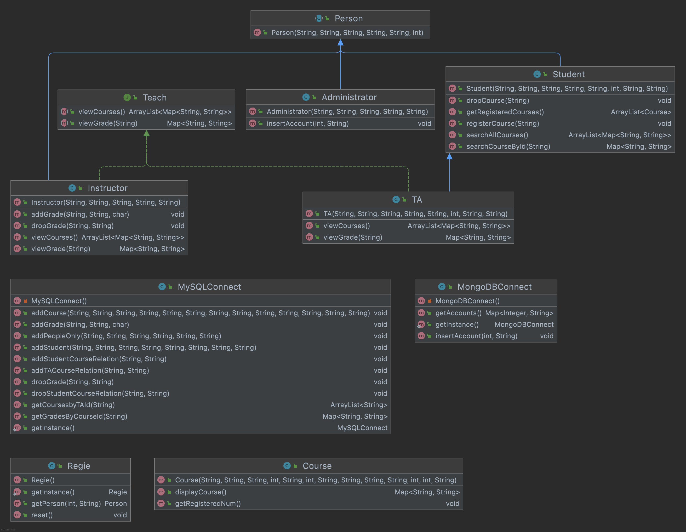

# New Course Registration System: REGIE

## How to use

This is a unit-test-based course registration system.

1. Initialize MySQL Database
    1. MySQL server information:  
       host: localhost  
       port: 3306  
       user: root  
       password: rootps123)
    2. Navigate to the "course_registration_system" folder.
    3. Run ```sudo mysql -u root -p < ./db/20220317T155200-create_database.sql``` in command line to create MySQL
       database.
    4. Run ```sudo mysql -u root -p < ./db/20220317T155400-create_tables.sql``` in command line to create tables to the
       database created above.
    5. Run ```sudo mysql -u root -p < ./db/20220318T084600-insert_data.sql``` in command line to insert initial data to
       the tables created above.
2. Initialize MongoDB Database
    1. Launch a MongoDB server by running ```mongo``` in command line to enter the MongoDB shell.
    2. Run ```use regie``` in the MongoDB shell to create a database named regie.
    3. Run ```db``` in the MongoDB shell will return "regie", this is to make sure we are in the regie database.
    4. Run ```db.createUser({user:"root", pwd:"rootps123", roles: ["readWrite", "dbAdmin"]});``` to create a user.
    5. Run ```db.createCollection("account");``` to add a collection "account".
    6. Insert document to the "account" collection by running the following commands in shell:
       ```db.account.insert({uid: "1", password: "rootpassword"})```    
       ```db.account.insert({uid: "2", password: "ironpassword"})```  
       ```db.account.insert({uid: "3", password: "scarletpassword"})```  
       ```db.account.insert({uid: "4", password: "apassword"})```  
       ```db.account.insert({uid: "5", password: "bpassword"})```  
       ```db.account.insert({uid: "6", password: "cpassword"})```  
       ```db.account.insert({uid: "7", password: "dpassword"})```
3. Run unit tests in the ./src/uniitest folder. (See the HTML version test result reports in demo folder.)

## Object Oriented Design

- UML of the Regie system: 
- Used Singleton Pattern for MongoDBConnect, MySQLConnect, and Regie.
- Defined the abstract class Person, with Student, Instructor and Administrator inheriting from it.
- TA class is inherited from Student, because teaching assistant is student.
- TA has some teaching behaviors and these behaviors are not exactly the same with instructors, so both Instructor and
  TA implements the Teach interface. This accomplishes polymorphism.
- TA is not inherited from Instructor, because some behaviors only belong to instructors, not TAs, for example assigning
  grades, drop grades.
- Student, TA, and Instructor do not have direct access to databases, instead, they can only use functions to insert or
  retrieve data. 
- User only need to interact with the Regie class to guarantee encapsulation. Once a regie from the Regie class is constructed, it stores all
  courses, students, TAs, instructors and administrators in its attributes. Each time a user wants to get a character,
  for example, a student, the user need to call the getPerson function of Regie to get the instance by providing a valid
  uid and password.